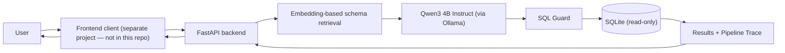
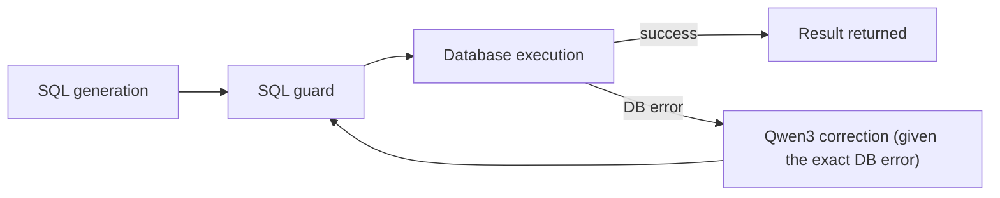

# SQLGenie

**An AI-powered Text-to-SQL analytics agent — ask questions about your data in plain English, get validated SQL and real results back, running entirely on local inference.**

> **Scope note:** this repository contains the **backend** (Python/FastAPI) only. There is no frontend application in this repo (no `package.json`, no React/TypeScript code) — the backend is CORS-configured and trace/theme-aware for a separate frontend client, but that client lives outside this repository. All architecture, setup and tech-stack details below describe what is actually implemented here.

## Related Repository

The frontend for SQLGenie is maintained in a separate repository: [SQLGenie-Frontend](https://github.com/23-nishtha/SQLGenie-Frontend).

---

## 1. Overview

SQLGenie lets a user ask a natural-language question about a structured dataset and get back real query results — no SQL knowledge required. Under the hood:

1. The question is matched against the active database's schema using **embedding-based retrieval-augmented generation (RAG)** — only the relevant tables/columns are selected, not the whole schema.
2. That relevant schema context is handed to a **local Qwen3 4B Instruct model running through Ollama**, which generates one SQL query.
3. The generated SQL passes through a **guardrail layer** (read-only, single-statement, keyword-tokenized validation) before anything touches a database.
4. The validated query executes against a **read-only SQLite connection**.
5. If execution fails (e.g. a wrong column name), the exact database error is sent back to the model for **one or two self-correction attempts** before giving up.
6. The result (rows, SQL, dataset info, and a full step-by-step execution trace) is returned as JSON.

---

## 2. Key Features

- Natural-language Text-to-SQL over SQLite databases
- **Embedding-based RAG** over database schema/metadata (not raw rows)
- Table/question embeddings via **nomic-embed-text**, served locally by Ollama
- **Cosine-similarity** schema ranking, with one-hop foreign-key expansion
- SQL generation via **Qwen3 4B Instruct**, served locally by **Ollama** (no cloud LLM required)
- Optional OpenAI and a network-free mock mode, selectable via one environment variable
- **Three built-in datasets** (Olist e-commerce, international football results, IMDb Top 1000 movies)
- **CSV upload**: any `.csv` becomes a queryable SQLite table and the active dataset immediately
- **SQL guardrails**: single-statement, read-only (SELECT/CTE-only), token-level keyword denylist, automatic row-limit enforcement
- **Read-only database execution** (OS-level `mode=ro` + `PRAGMA query_only`, independent of the guardrail layer)
- **Error-driven SQL self-correction**: a failed query's exact database error is fed back to the model for up to two corrected retries
- **Full pipeline trace** on every request: schema retrieval, SQL generation, guard decision, execution, and any correction attempts, each with timing
- Result data returned as structured **tables** (rows + columns); no charting is implemented
- Backend-provided **theme metadata** per dataset (e.g. `commerce`, `football`, `entertainment`) for a frontend to theme around — the backend never sends styling itself

---

## 3. Architecture



**Self-correction path** (triggered only when validated SQL fails at execution time):



Every corrected query — not just the first attempt — passes through the same SQL guard before execution. A guard rejection (as opposed to a database error) is never retried.

---

## 4. RAG: how retrieval actually works

RAG here applies to **database schema and metadata**, never to raw database rows. SQLGenie does not retrieve or embed table contents, and it does not use a vector database (no Pinecone, Chroma, FAISS, or Weaviate) — embeddings are computed via a local Ollama call and held in an in-memory cache.

The pipeline:

1. **Schema documents** are built for every table/view: its name, real column list (read live from SQLite), and — where a dataset has one — a curated description and keyword set.
2. Each schema document's text (name + columns + description/keywords + any directly-involved relationships) is **embedded once**, using **nomic-embed-text** via Ollama.
3. The **user's question is embedded** the same way, once per request.
4. Schema documents are ranked by **cosine similarity** against the question's embedding.
5. The top-ranked tables are expanded by **one hop** of known foreign-key relationships, so the model always sees how to join what it's given (e.g. asking about orders also pulls in `customers` if they're joined).
6. If nothing ranks confidently, retrieval falls back to a sensible default (the dataset's hub table, or the first table for a single-table dataset).
7. Only this **relevant subset** — plus a few dataset-specific notes — is rendered as text and passed to Qwen3 for SQL generation.
8. **Caching**: table embeddings are computed once per dataset (at startup, or after switching/uploading a dataset) and cached in memory, keyed by dataset — never recomputed per question. Only the question itself is embedded on every request.

A dataset with only one table (every CSV upload, plus the built-in football and movies datasets) skips embedding entirely — there's nothing to rank — and the single table is used directly.

---

## 5. LLM

- **SQL generation model:** Qwen3 4B Instruct, run **locally through Ollama** (`http://localhost:11434` by default) — no request ever leaves the machine for SQL generation in this mode.
- **Why local inference:** no external API credits are consumed, and both the question text and any schema/data context stay on the local machine.
- **Embeddings model:** nomic-embed-text, also served locally through Ollama, used only for schema retrieval (never for SQL generation).
- **Other modes that genuinely exist in the code** (`backend/llm.py`), selectable via `SQLGENIE_LLM_MODE`:
  - `mock` — a deterministic, hand-written lookup table of canned SQL for a fixed set of known questions. No network call, no API key. This is the default, so the project runs out of the box.
  - `openai` — a real call to the OpenAI Chat Completions API (`OPENAI_API_KEY` / `OPENAI_MODEL` required). Schema retrieval still always uses the local Ollama embedding model regardless of this setting — only SQL generation would use OpenAI.

---

## 6. Datasets

**Built-in:**

| Dataset | Domain | Description |
|---|---|---|
| Olist Brazilian E-Commerce | E-commerce | Customers, orders, order items, payments, reviews, products and sellers — the largest built-in schema (10 tables/views). |
| International Football Results | Sports | Match results from 1872–present: teams, scores, competition, venue, and derived winner/goal-difference columns. |
| IMDb Top 1000 Movies | Entertainment | Title, year, rating, genre, director, cast, votes and box-office gross. |

**CSV upload:**

- Accepts **`.csv` files only**.
- The uploaded CSV is converted into a **new SQLite table** (column names and the table name are sanitized into safe SQL identifiers; cell values are inserted via parameterized queries, never string-formatted into SQL).
- The uploaded dataset becomes the **active dataset immediately** after upload — the next question is asked against it.
- A domain/theme (e.g. "sports", "finance") is guessed from the filename, column names, and a sample of values — no LLM is involved in that guess.

---

## 7. Guardrails and safety

Implemented in `backend/sql_guard.py` and `backend/db.py`, and covered by `tests/test_sql_guard.py`:

- **Single statement only** — a payload like `SELECT ...; DROP TABLE ...` is rejected outright.
- **Read-only shape required** — the statement must start with `SELECT` or `WITH` (a CTE); anything else is rejected.
- **Token-level keyword denylist** — every SQL token (not a naive string search) is checked against a denylist including `INSERT`, `UPDATE`, `DELETE`, `DROP`, `ALTER`, `CREATE`, `TRUNCATE`, `ATTACH`, `PRAGMA`, `VACUUM`, and transaction/permission statements. This also catches a CTE followed by a disallowed statement (e.g. `WITH t AS (SELECT 1) DELETE FROM orders`), since the whole statement is scanned, not just the first keyword.
- The denylist check only matches real SQL **keyword tokens** — the word "delete" appearing inside a quoted string value is correctly left alone.
- **Automatic row limiting** — if the generated SQL has no `LIMIT`, one is added (wrapping the query rather than naively appending text, so it's safe even if the query ends in `ORDER BY` or a comment); the limit is configurable (`MAX_ROWS`, default 200).
- **Read-only execution, independent of the guard** — `backend/db.py` opens the SQLite file with `mode=ro` and sets `PRAGMA query_only`, so even if the guard were somehow bypassed, the database connection itself refuses writes.
- **Query timeout** — a long-running query is aborted via a SQLite progress handler (`QUERY_TIMEOUT_SECONDS`, default 10s), guarding against an accidental runaway query (e.g. an unintended cross join).

This is a guard against **writes and runaway queries**, not a general SQL-injection firewall for arbitrary intent — a read-only query that happens to use a classic injection shape (e.g. `OR '1'='1'`) is still just a read, and is allowed, since it cannot modify or exfiltrate anything beyond what the query already had access to.

---

## 8. Self-correction

When a generated query passes the guard but fails against the real database (e.g. a column name that doesn't exist), SQLGenie doesn't give up immediately:

1. The exact SQLite error is sent back to the model along with the original question, the schema context, and the failed SQL.
2. The model returns a corrected query.
3. The corrected query goes through the **exact same guard and execution path** as the first attempt — correction only changes how new SQL is *proposed*, never how it's *approved*.
4. This repeats for up to **2 correction attempts** (3 total tries, including the first). If every attempt fails, the request returns a clear error listing what was tried and why each attempt failed.

A guard rejection (invalid/unsafe SQL) is never retried — only a genuine database execution error triggers a correction attempt.

---

## 9. Tech Stack

| Layer | Technology |
|---|---|
| Backend framework | Python + FastAPI |
| Database | SQLite |
| SQL generation LLM | Qwen3 4B Instruct |
| Embeddings model | nomic-embed-text |
| Local inference runtime | Ollama |
| SQL parsing/validation | `sqlparse` + custom guardrail logic (`backend/sql_guard.py`) |
| CSV handling | `pandas` |
| API server | `uvicorn` |
| Testing | `pytest` |
| Version control | Git + GitHub |
| Frontend | *Not included in this repository* (a separate client is expected to call this API; CORS is pre-configured for local dev on ports 5173 and 8080) |

---

## 10. Project Structure

```text
SQLGenie/
├── backend/
│   ├── main.py              # FastAPI app: HTTP endpoints, CORS, error mapping
│   ├── agent.py             # Pipeline orchestration + self-correction loop
│   ├── llm.py                # SQL generation (mock/openai/ollama) + embeddings (Ollama)
│   ├── mock_llm.py          # Canned SQL answers for the zero-network "mock" mode
│   ├── schema_retrieval.py  # Embedding-based RAG: ranking, caching, FK expansion
│   ├── schema_context.py    # Reads live table/column info straight from SQLite
│   ├── schema_profiles.py   # Curated per-dataset descriptions/keywords/relationships
│   ├── sql_guard.py         # SQL validation guardrails
│   ├── db.py                 # Read-only SQLite execution
│   ├── dataset.py           # Dataset registry + active dataset (built-in + uploaded)
│   ├── csv_upload.py         # CSV → SQLite conversion and sanitization
│   ├── domain_detection.py   # Guesses an uploaded dataset's domain/theme
│   ├── trace.py              # Step-by-step pipeline trace recording
│   ├── models.py             # Pydantic request/response/trace schemas
│   └── config.py             # Environment-driven settings
├── database/
│   ├── football/, movies/    # Build scripts + schema for the built-in datasets
│   └── raw/                   # Raw source CSVs for the Olist dataset
├── tests/                     # pytest suite (254 tests)
├── uploads/                    # Runtime storage for uploaded CSV-derived SQLite files (git-ignored)
├── requirements.txt
├── .env.example
└── README.md
```

---

## 11. Setup (Windows)

### 1. Clone and create a Python environment

```powershell
git clone <this-repo-url>
cd SQLGenie
python -m venv .venv
.venv\Scripts\activate
pip install -r requirements.txt
```

### 2. Install and configure Ollama

Download and install Ollama from [ollama.com](https://ollama.com), then pull the SQL-generation and embedding models:

```powershell
ollama pull qwen3:4b
ollama pull nomic-embed-text:latest
```

> The default SQL-generation model is `qwen3:4b` (`OLLAMA_MODEL` in `.env`). If you prefer a specific instruction-tuned quantization (e.g. `qwen3:4b-instruct-2507-q4_K_M`), pull that tag instead and set `OLLAMA_MODEL` accordingly.

Make sure Ollama is running (it typically runs as a background service after install; otherwise start it with `ollama serve`).

### 3. Configure environment variables

```powershell
copy .env.example .env
```

Edit `.env` as needed. Key variables (see `.env.example` for the full, commented list):

| Variable | Purpose |
|---|---|
| `SQLGENIE_LLM_MODE` | `mock` (default, no network), `openai`, or `ollama` |
| `OLLAMA_MODEL` | SQL-generation model tag |
| `OLLAMA_EMBED_MODEL` | Embedding model tag (default `nomic-embed-text:latest`) |
| `OLLAMA_BASE_URL` | Ollama's API URL (default `http://localhost:11434`) |
| `SQLGENIE_DATASET` | Which built-in dataset is active at startup (default `olist`) |
| `CORS_ALLOWED_ORIGINS` | Allowed frontend origins |

To use the real Qwen3 model rather than the network-free mock answers, set:

```dotenv
SQLGENIE_LLM_MODE=ollama
```

Never commit a real `.env` file or any API key — `.env` is git-ignored; only `.env.example` (no secrets) is tracked.

### 4. Start the backend

```powershell
uvicorn backend.main:app --reload
```

The API is now available at `http://127.0.0.1:8000`, with interactive docs at `http://127.0.0.1:8000/docs`.

> There is no frontend to start in this repository — see the scope note at the top.

---

## 12. Testing

```powershell
pytest
```

Latest verified result:

```text
254 passed, 2 warnings
```

The two warnings are FastAPI deprecation warnings (`@app.on_event("startup")` is deprecated in favor of lifespan event handlers) — they don't indicate a test failure. The suite requires no live Ollama server, no OpenAI key, and no real network access: `SQLGENIE_LLM_MODE` is pinned to `mock` for the test session, and embedding calls are intercepted with a deterministic, in-process fake.

No frontend test suite exists in this repository.

---

## 13. Example Questions

**Football** (built-in dataset)

- "Which team has the most wins?"
- "How many matches has Brazil played?"
- "What is the highest goal difference in a match?"

**Olist** (built-in e-commerce dataset)

- "How many orders were delivered?"
- "What are the top 5 product categories by revenue?"
- "What is the average order value?"

**IMDb Top 1000 Movies** (built-in dataset)

- "What are the top 5 highest rated movies?"
- "Which director has the most movies?"
- "What is the average rating by genre?"

**CSV upload** (e.g. uploading a `titanic.csv` with passenger/survival columns — illustrative, not a bundled dataset)

- "How many rows are in this dataset?"
- "How many passengers survived?" — works once the uploaded CSV actually has a `survived`-style column; CSV upload itself is fully generic and dataset-agnostic.

---

## 14. Resume-ready project description

- Built an end-to-end Text-to-SQL analytics agent that converts natural-language questions into validated, executed SQL using a locally-hosted Qwen3 4B Instruct model via Ollama — no cloud LLM dependency.
- Designed and implemented an embedding-based RAG pipeline over database schema metadata (nomic-embed-text embeddings, cosine-similarity ranking, one-hop foreign-key expansion, in-memory caching) to keep LLM context small and accurate across multiple heterogeneous datasets.
- Implemented a layered SQL safety system — token-level guardrails, read-only database execution, and error-driven self-correction — with a full step-by-step execution trace returned on every request for observability.

---

## 15. Future Scope

> Future improvements — not currently implemented.

- A bundled frontend client in this repository
- Chart/visualization rendering of query results
- Support for additional local embedding/LLM model options
- Persistent (disk-backed) embedding cache across process restarts
- Automatic cleanup of old uploaded datasets

---

## 16. License

No license file currently exists in this repository. A license can be added later.
